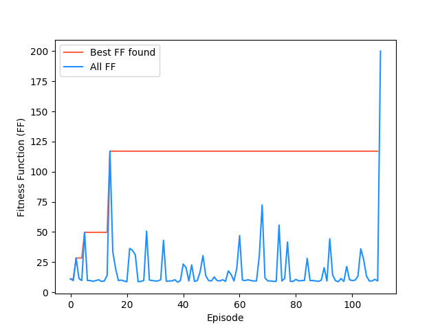
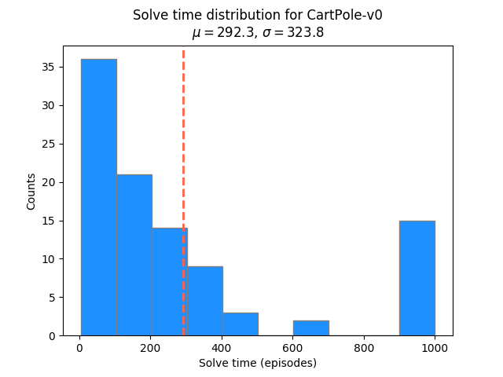

# Random Weight Guessing (RWG) benchmarking

For benchmarking, using the [tinynet](https://github.com/giuse/tinynet) library.

RWG is simply randomly guessing the weights of a neural network (NN) until it gives the desired behavior. It's strangely effective at many tasks. A likely hypothesis that's been put forward is that valid sets of weights are "dense" in weight-space; i.e., a relatively large portion of the possible weight sets solve the problem.

Although RWG would probably have trouble with very complex tasks, the fact that it does so reasonably well a these simpler ones indicates that at the very least, it should be a good benchmark to compare other algorithms to.

## CartPole-v0

Here, we're just testing it for the `CartPole-v0` environment. It's incredibly simple, and thus, it solves it very quickly:

<p align="center">
  
</p>

You can see that because it's doing RWG, the results of runs are independent of the previous ones, i.e., nothing "builds off" of previous runs.

<p align="center">
  
</p>

Being random, it has a lot of variance in how many generations it takes to find a solution. A more rigorous experiment would run this many times to get a distribution of the solve times.

I also added a feedforward NN (class `FFNN1L.py`), since the default RNN isn't crucial for most classic control problems, and adds extra weights that increase the search space. It seems to solve it lots faster on average, as expected.

The [OpenAI gym leaderboard score](https://github.com/openai/gym/wiki/Leaderboard#cartpole-v0) for `CartPole-v0` gives a fastest solve time of 24 episodes before solve. This is pretty fast, but also hard to compare to for several reasons:

* lots of the top scores are tailor made to the environment (see the "0 episodes" solve time for the top `MountainCar-v0`)
* What are their statistics? Did they run it for 1000 and choose the fastest one? In that case, RWG can sometimes solve it in 1 or 2 episodes (if it gets lucky)

## Use

To run it for the cartpole environment, do:

```
python3 scripts/cartpole_example.py
```

This will run it for a maximum of 1000 generations. Each generation, it will reset the weights of a 1 layer RNN (from class `RNN1L`), and use it to play 3 episodes of CartPole. It takes the average of these 3 episodes to get a representative score. If this score is better than the current best score, it runs this NN for 100 trials (`CartPole-v0`'s "solved" condition is having an average score of 195.0 over 100 trials).

If it's solved, it breaks. When it's done, it plots the best FF at each generation, as well as the FF from each generation. Then, it runs an episode with the best weights set found, and saves the video.


## Higher order benchmarking

The above solves the `CartPole-v0` env. However, we want to benchmark more envs. In addition, a single solve isn't representative, especially given the randomness inherent in many of these environments. What would give more specific info is to do the above benchmarking, but run it a number of times to create a distribution.

This is easily doable with the `Evolve` class and the `Benchmark.py` functions. Briefly, an `Evolve` object creates an `Agent` class object for a given env, and then `Evolve.evolve()` does RWG to try and solve that env. It returns the solve time (in number of generations).

`Benchmark.benchmark_envs()` takes a list of envs. For each, it creates a dist of the solve times, by (some specified number of times) creating a new `Evolve` object and solving the env.

Here's a simple usage, from `scripts/benchmark_example.py`:

```
import path_utils
import Benchmark

Benchmark.benchmark_envs(['CartPole-v0'], N_dist=100, N_gen=1000)
```

This will only benchmark `CartPole-v0`. It will create a distribution of solve times from `N_dist` instances of that env. Each one will have a max number of generations `N_gen` (if it doesn't solve in that time, it gets marked as the maximum time; this might be suboptimal because it's underestimating these outliers).

This produces:

<p align="center">
  
</p>

Something curious: even though it seems to have a well-defined Gamma-like (?) distribution shape, there are always some at the maximum `N_gen` (meaning they didn't solve). This is curious, since every iteration of `evolve()` is independent. However, since we're just testing for `mean_score` > `best_score`, it's possible that it gets a "lucky" set of weights that got a high score for its 3 episode trials, but couldn't solve it. Then, later sets that might not get as high a 3-episode score, but *would* solve it, don't get tested. This has to be looked at more.

In addition, it creates a timestamped directory in the `outputs` directory for the benchmarking run. Within that, it creates:

* For each env benchmarked, a directory with the FF plot for each run
* A distribution plot for each env
* A .json file with the solve times for each env, `solve_time_dists.json`

Example structure:

```
├── output
│   ├── Benchmark_17-07-2019_10-52-41
│   │   ├── CartPole-v0
│   │   ├── CartPole-v0_solve_gen_dist.png
│   │   ├── LunarLander-v2
│   │   ├── LunarLander-v2_solve_gen_dist.png
│   │   └── solve_time_dists.json
│   └── Benchmark_17-07-2019_10-57-01
│       ├── CartPole-v0
│       ├── CartPole-v0_solve_gen_dist.png
│       └── solve_time_dists.json
```

(the FF plots for each env have been omitted, as there are `N_dist` many of them.)

Similarly, `Benchmark.benchmark_classic_control_envs()` will call `Benchmark.benchmark_envs()` with only the "classic control" envs.

Other simple variations have been added, to be tested:

* Softmax vs argmax outputs for discrete action spaces
* Different activation functions (even linear can solve many of these environments! See CartPole and LunarLander solves here: https://www.declanoller.com/2019/01/25/beating-openai-games-with-neuroevolution-agents-pretty-neat/ )
* Feedforward vs RNN networks (currently using FF as default, because it seems to solve much quicker)


## Relevant links

* https://github.com/giuse/tinynet
* https://www.bioinf.jku.at/publications/older/ch9.pdf
* https://gist.github.com/giuse/3d16c947259173d571cf82e28a2f7a7e
