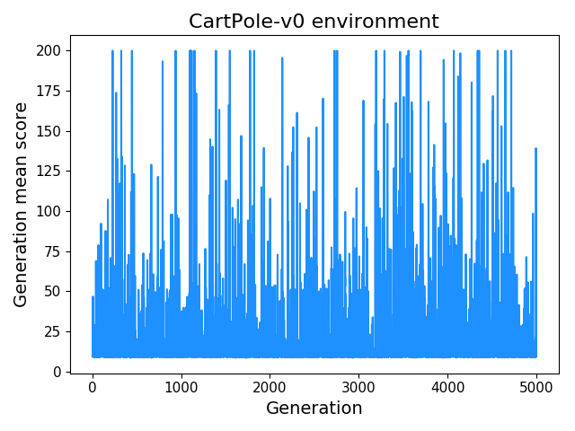

# Random Weight Guessing (RWG) benchmarking

For benchmarking, inspired by the [tinynet](https://github.com/giuse/tinynet) library.

RWG is simply randomly guessing the weights of a neural network (NN) until it gives the desired behavior. It's strangely effective at many tasks. A likely hypothesis that's been put forward is that valid sets of weights are "dense" in weight-space; i.e., a relatively large portion of the possible weight sets solve the problem.

Although RWG would probably have trouble with very complex tasks, the fact that it does so reasonably well a these simpler ones indicates that at the very least, it should be a good benchmark to compare other algorithms to.

## Overview of system

We select an OpenAI gym environment (env), and a simple NN topology (for example, no hidden layers, only weights connecting inputs to outputs) to control the policy for an agent in that env. A "generation" is defined as a set of (`N_trials`) episodes for which the NN has the same set of weights; because different initial env conditions give different scores for the same NN, we want to evaluate the same NN on more than one trial in the environment to get a more accurate measurement of its average behavior. At the beginning of each generation, the NN is "reset" such that a new random set of weights is chosen from a Normal distribution with mean 0, standard deviation 1.

If we do this for many generations, for example with the `CartPole-v0` env, we can produce a plot of the mean score (across the `N_trials` episodes) of each generation:

<p align="center">
  
</p>

or, displayed more clearly as a log histogram:

<p align="center">
  
</p>

or, we can sort the generations by mean score (the black line), but at each one, also plot the scores (red circles) for the individual episodes of that generation:

<p align="center">
  
</p>

You can see that there are already many probable solutions (average scores of ~200). We can run and save an episode with the best performing ones:

<p align="center">
  
</p>

Note that because it's doing RWG, the results of runs are independent of the previous ones, i.e., nothing "builds off" of previous runs. However, running for longer obviously randomly samples the weight-space longer, increasing the chances of stumbling upon a solution.

## Other analyses

What other information can we get from analyzing this very simple data collection?

If we plot the variance of scores of the trials in each generation as a function of their mean score, we can see a pattern emerge:

<p align="center">
  
</p>

It appears that for increasing mean score, the variance increases, until a certain point, where for the very high mean scores, the variance decreases again. One explanation for this is that some NNs have sets of weights that can *never* perform well (giving a low mean score), others have ones that do work well for some of the initial conditions (i.e., "always go left"), giving a mix of very high and very low scores, and then some sets of weights give rise to NNs that *always* perform well, meaning the variance is very low.

Not as illuminating in this case, but another analysis tool could be looking at the average L2 sum of the weights of NNs, as a function of their mean scores:

<p align="center">
  
</p>

Similarly, we can look at the L0, which could reveal whether weight sets have a bias in the positive or negative direction.


## Use

To run a simple example of RWG for `CartPole-v0`, we can run `python3 scripts/evolve_example.py`, which does:

```
import path_utils
from Evolve import Evolve

e = Evolve('CartPole-v0', NN='FFNN', N_hidden_layers=0)
evo_dict = e.evolve(2000, N_trials=20, print_gen=True)
e.save_all_evo_stats(evo_dict)
```

This runs a NN with no hidden layers, for 2000 generations, of 20 episodes each, and then plots all the results to a directory it creates.

More to be added!

## Relevant links

* https://github.com/giuse/tinynet
* https://www.bioinf.jku.at/publications/older/ch9.pdf
* https://gist.github.com/giuse/3d16c947259173d571cf82e28a2f7a7e
